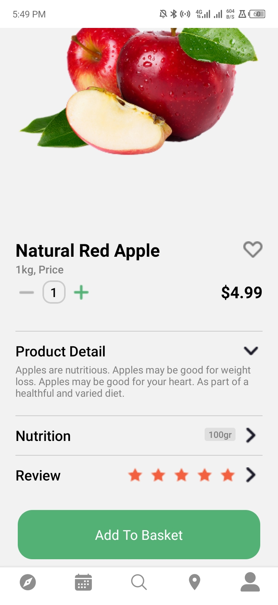
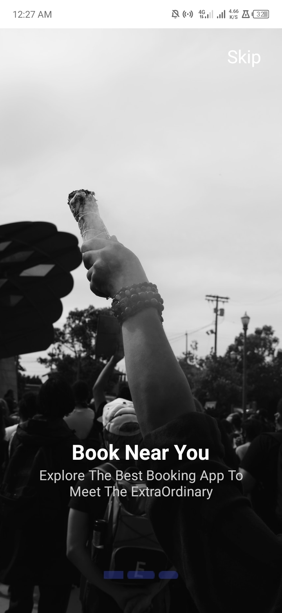

# Welcome to my Expo App 😊

This is an [Expo](https://expo.dev) project created with [`create-expo-app`](https://www.npmjs.com/package/create-expo-app).

## Get started

1. Install dependencies

   ```bash
   npm install
   ```

2. Start the app

   ```bash
    npx expo start
   ```

In the output, you'll find options to open the app in a

- [development build](https://docs.expo.dev/develop/development-builds/introduction/)
- [Android emulator](https://docs.expo.dev/workflow/android-studio-emulator/)
- [iOS simulator](https://docs.expo.dev/workflow/ios-simulator/)
- [Expo Go](https://expo.dev/go), a limited sandbox for trying out app development with Expo

You can start developing by editing the files inside the **app** directory. This project uses [file-based routing](https://docs.expo.dev/router/introduction).

## Get a fresh project

When you're ready, run:

```bash
npm run reset-project
```

This command will move the starter code to the **app-example** directory and create a blank **app** directory where you can start developing.

## Learn more

To learn more about developing your project with Expo, look at the following resources:

- [Expo documentation](https://docs.expo.dev/): Learn fundamentals, or go into advanced topics with our [guides](https://docs.expo.dev/guides).
- [Learn Expo tutorial](https://docs.expo.dev/tutorial/introduction/): Follow a step-by-step tutorial where you'll create a project that runs on Android, iOS, and the web.

## Join the community

Join our community of developers creating universal apps.

- [Expo on GitHub](https://github.com/expo/expo): View our open source platform and contribute.
- [Discord community](https://chat.expo.dev): Chat with Expo users and ask questions.

# A Project from my Mobile App Development Boot camp @TechGig
This project was developed from the knowledge I gained at TechGig from 14th March, 2025 to June, 2025.

## Assignment I
Our instructor gave us four UIs to create. The screens include an onboarding screen, number screen, sign-in screen and product details screen.

Here are screenshots of the screens:
- ### Onboarding Screen:


- ### Sign-in screen:


- ### Number screen:


- ### Product details screen:



## Assignment II
We were tasked to code four UIs that consist of three onboarding screens and a home-scroll screen

Here are the screens:
- ### First onboarding screen:


- ### Second Onboarding screen:


- ### Third Onboarding screen:


- ### Home sroll screen (to display items in a flatlist):


